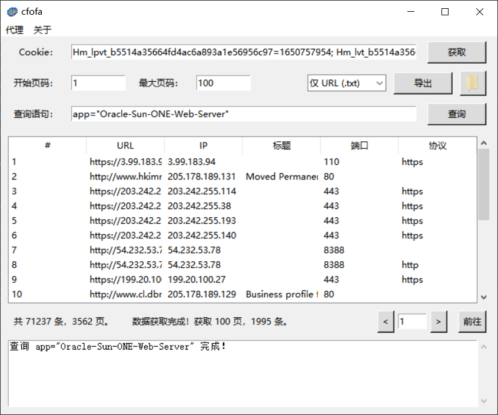

# cfofa
一款用于获取 fofa 数据的实用工具。



# 安装
要求 python 3.x
```
pip3 install -r requirement.txt
```

# 使用
cfofa 使用 Cookie 进行数据查询，主要应用于普通会员进行查询。

cfofa 会自动保存会话内容，以便在下次打开时恢复。

## 开始查询
双击 start.vbs 或运行 cfofa.py 打开应用：
1. 在 Cookie 输入框中输入 fofa Cookie。
2. 设置开始页码和最大页码。
3. 输入查询语句，点击查询按钮开始查询。

### Cookie 使用说明
- 每次刷新浏览器获取的 Cookie 有效时间大概为一天左右。
- 如果已在浏览器中登录 fofa，可以点击 Cookie 输入框右边的获取按钮一键获取 Cookie。
- 自动获取 Cookie 功能使用 Browser-Cookie3 包实现，支持大部分主流浏览器。

## 查询结果
- 默认显示开始页。
- 右键条目可以快速复制 IP、URL 或者打开 URL。

## 结果导出
可以导出为 csv 文件或者单独导出 IP、URL，单独导出 IP、URL 会自动去除重复项。
导出后点击右边的文件夹按钮快速打开导出目录。

# 注意事项
由于 cfofa 使用 Cookie 进行查询，而 fofa 对查询有次数的限制，因此每查询一页便消耗一次，请注意查询次数。